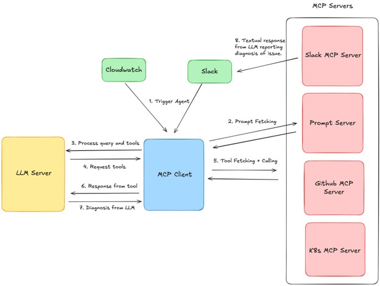

# Inteligência Artificial Agêntica na Engenharia de Confiabilidade: Uma Análise do SRE Agent Baseado em LLM, MCP e Arquitetura Cloud-Native

**Adriano Luiz Atanes do Amaral**

Trabalho apresentado para o course MIT 500 – Artificial Intelligence da American Global Tech University - AGTU.

## Resumo

O SRE Agent desenvolvido pela Fuzzy Labs demonstra como agentes baseados em Large Language Models (LLMs) podem apoiar a investigação de incidentes ao integrar raciocínio probabilístico com ferramentas operacionais por meio do Model Context Protocol (MCP). Este estudo analisa técnica e criticamente essa abordagem, considerando sua arquitetura, efetividade, segurança, eficiência e aplicabilidade em operações de TI e ambientes de alta criticidade. Os resultados indicam que agentes de IA podem automatizar etapas relevantes do diagnóstico e reduzir atividades manuais durante a investigação de incidentes. Entretanto, sua adoção em ambientes produtivos depende menos da capacidade isolada do LLM e mais da qualidade da observabilidade e do contexto disponível, da arquitetura de integração, dos controles de acesso, da segurança da comunicação entre componentes e de mecanismos de governança capazes de limitar a autonomia diante da incerteza. Conclui-se que a evolução desses agentes para operações mais autônomas exige uma arquitetura confiável ao redor do modelo, combinando inteligência artificial, observabilidade, segurança e governança.

**Palavras-chave:** Inteligência Artificial Agêntica; SRE; Observabilidade; Model Context Protocol; Confiabilidade; AIOps.

## Abstract

The SRE Agent developed by Fuzzy Labs demonstrates how agents based on Large Language Models (LLMs) can support incident investigation by integrating probabilistic reasoning with operational tools through the Model Context Protocol (MCP). This study provides a technical and critical analysis of this approach, considering its architecture, effectiveness, security, efficiency, and applicability to IT operations and highly critical environments. The results indicate that AI agents can automate relevant stages of diagnosis and reduce manual activities during incident investigation. However, their adoption in production environments depends less on the isolated capabilities of the LLM and more on the quality of observability and available context, integration architecture, access controls, secure communication between components, and governance mechanisms capable of constraining autonomy under uncertainty. It is concluded that the evolution of these agents toward more autonomous operations requires a reliable architecture around the model, combining artificial intelligence, observability, security, and governance.

**Keywords:** Agentic Artificial Intelligence; SRE; Observability; Model Context Protocol; Reliability; AIOps.

# 1. Introdução

A transformação das arquiteturas de Tecnologia da Informação (TI), impulsionada pela computação em nuvem, microsserviços, containers e plataformas como Kubernetes, aumentou a escalabilidade dos sistemas, mas também ampliou sua complexidade operacional. Em ambientes distribuídos, uma indisponibilidade pode ter origem na aplicação, infraestrutura, rede, banco de dados, configurações ou serviços externos. Essa característica torna a investigação de incidentes uma atividade que exige correlação entre diferentes sinais e fontes de informação. No contexto do Site Reliability Engineering (SRE), monitoramento e observabilidade são fundamentais nesse processo. Beyer et al. (2016) destacam latência, tráfego, erros e saturação como sinais essenciais para compreender o comportamento de sistemas distribuídos.

Essa complexidade torna-se ainda mais evidente em operações de TI de alta criticidade e disponibilidade 24x7. Na realidade profissional vivenciada em ambientes corporativos, a investigação de incidentes frequentemente envolve salas de crise e a atuação coordenada de equipes de sustentação, SRE, observabilidade, infraestrutura e desenvolvimento. Parte relevante do tempo de diagnóstico pode ser consumida na coleta e correlação de alertas, logs, métricas, informações de infraestrutura, código-fonte e indicadores de negócio distribuídos entre diferentes ferramentas. Nesse cenário, reduzir o esforço necessário para reunir contexto e identificar possíveis causas representa uma oportunidade relevante para aplicação de Inteligência Artificial.

O avanço dos Large Language Models (LLMs) e da Inteligência Artificial Agêntica apresenta uma nova possibilidade para esse processo: agentes capazes de interpretar contexto, selecionar ferramentas e coletar informações de diferentes sistemas. Diferentemente de automações convencionais baseadas em fluxos previamente definidos, esses agentes podem determinar dinamicamente quais ferramentas utilizar durante uma investigação, construindo seu diagnóstico a partir das evidências encontradas.

O caso selecionado para este estudo é o SRE Agent desenvolvido pela Fuzzy Labs, apresentado no artigo *How We Built Our SRE Agent Using FastMCP*. A solução avalia a aplicação de agentes de IA em atividades relacionadas à confiabilidade de sistemas. O experimento utiliza uma versão modificada da aplicação Online Boutique, composta por microsserviços, na qual foram introduzidas falhas intencionais. A Fuzzy Labs desenvolveu um agente utilizando o modelo Claude e o Model Context Protocol (MCP), implementado com FastMCP, permitindo acesso a ferramentas relacionadas ao Kubernetes, GitHub e Slack (Clare, 2025).

A partir da identificação de um problema, o agente pode localizar o componente relacionado à falha, consultar logs do Kubernetes, identificar evidências sobre sua possível origem, acessar código-fonte no GitHub e produzir um diagnóstico posteriormente comunicado pelo Slack (Clare, 2025). O LLM atua, portanto, como uma camada de raciocínio e orquestração sobre diferentes dados e ferramentas operacionais.

Os resultados demonstram potencial, mas também limitações. Em cinco cenários de falha avaliados, o agente identificou corretamente a causa e recomendou uma solução adequada em três casos (Wong, 2025). As falhas observadas estavam relacionadas à indisponibilidade de informações históricas e à ausência de ferramentas capazes de fornecer determinados dados de infraestrutura. Isso evidencia um aspecto particularmente relevante para operações reais: a capacidade de um agente não depende exclusivamente do LLM, mas da qualidade da observabilidade, do contexto e das ferramentas às quais possui acesso. Além disso, sua integração com sistemas operacionais introduz riscos relacionados à segurança, privacidade e autonomia (Autio et al., 2024; Ibrahim, 2025).

Diante desse contexto, este estudo analisa técnica e criticamente o SRE Agent da Fuzzy Labs, buscando compreender em que medida uma arquitetura baseada em LLM e MCP pode contribuir para a investigação de incidentes em sistemas distribuídos e de alta criticidade. A análise considera dados, infraestrutura, arquitetura técnica, latência, eficiência, redes de computadores, segurança e incerteza, relacionando os resultados experimentais aos desafios encontrados em operações corporativas e avaliando as condições necessárias para sua adoção em ambientes produtivos.

# 2. Desenvolvimento

## 2.1. O SRE Agent da Fuzzy Labs e os Estudos Selecionados

O estudo de caso tem como referência principal o artigo *How We Built Our SRE Agent Using FastMCP*, publicado por Scott Clare em 2025. O trabalho descreve um agente experimental desenvolvido pela Fuzzy Labs para investigar incidentes em ambientes de Site Reliability Engineering (SRE). O problema abordado é recorrente em sistemas distribuídos: durante um incidente, profissionais precisam consultar diferentes fontes de informação, correlacionar evidências e formular hipóteses sobre a origem da falha.

Como ambiente experimental, a Fuzzy Labs utilizou uma versão modificada da aplicação Online Boutique, composta por microsserviços, na qual foram introduzidas falhas intencionais. A arquitetura utiliza Claude como Large Language Model (LLM) e o Model Context Protocol (MCP) como mecanismo de integração com ferramentas externas. Um cliente desenvolvido com FastMCP permite ao agente interagir com recursos relacionados ao Kubernetes, GitHub e Slack (Clare, 2025).

O diferencial da solução está na participação do LLM durante a investigação. Em vez de receber todas as informações previamente consolidadas, o agente seleciona ferramentas conforme as evidências encontradas. Em um dos cenários, um erro HTTP 500 no serviço de carrinho inicia a investigação. O agente identifica o pod correspondente, consulta seus logs, encontra uma referência ao arquivo `RedisCartStore.cs`, recupera seu conteúdo no GitHub e formula um diagnóstico posteriormente comunicado pelo Slack (Clare, 2025). O LLM atua, portanto, como uma camada de raciocínio e orquestração entre diferentes fontes operacionais.

A efetividade da solução foi posteriormente analisada por Oscar Wong no artigo *Measuring Agent Effectiveness*, publicado em 2025. Foram avaliados cinco cenários semelhantes a situações encontradas em produção. Em três casos relacionados a erros de aplicação, o agente identificou corretamente a causa e apresentou uma recomendação adequada. Nos outros dois, a investigação não alcançou o resultado esperado. Em um deles, o pod havia reiniciado e o agente não recuperou os logs anteriores; no outro, as ferramentas disponíveis não forneciam informações suficientes sobre os recursos do node Kubernetes (Wong, 2025).

Esses resultados possuem relevância quando relacionados à realidade de operações de TI de alta criticidade. Em uma sala de crise, por exemplo, a qualidade do diagnóstico depende da capacidade de reunir rapidamente informações distribuídas entre ferramentas de observabilidade, infraestrutura, aplicações e código. Dessa forma, uma limitação de contexto do agente pode produzir efeito semelhante ao enfrentado por uma equipe humana quando não possui telemetria suficiente para compreender uma falha. O resultado sugere que aumentar apenas a capacidade do LLM não resolve necessariamente o problema: é preciso ampliar também a qualidade das informações e ferramentas disponíveis para investigação.

A segurança foi aprofundada por Yazan Ibrahim no artigo *Can We Trust an Agent in Prod?*, publicado em 26 de junho de 2025. Embora os servidores MCP utilizados oferecessem dezenas de ferramentas potenciais, somente quatro operações essenciais foram disponibilizadas ao agente. Essa restrição reduz privilégios e superfície de ataque. O estudo também identifica riscos relacionados a prompt injection, credenciais e utilização indevida das ferramentas (Ibrahim, 2025).

Por fim, Mikhail (Misha) Iakovlev analisou eficiência e custos no artigo *How Expensive Is Autonomy? Crunching the Numbers on Agentic SREs*, publicado em 17 de julho de 2025. Técnicas de seleção de ferramentas e cache reduziram o custo estimado por diagnóstico em aproximadamente 83% (Iakovlev, 2025). Em conjunto, os estudos demonstram que a viabilidade do agente depende da combinação entre capacidade do LLM, contexto operacional, observabilidade, segurança e eficiência.

## 2.2. Análise Técnica e Arquitetural do SRE Agent

O desafio central da Fuzzy Labs é reduzir o esforço empregado na investigação de incidentes em arquiteturas distribuídas. Um engenheiro de confiabilidade normalmente precisa interpretar alertas, localizar componentes afetados, consultar dados operacionais e relacionar erros ao código da aplicação. Em operações 24x7, esse processo também pode envolver diferentes equipes e ferramentas, ampliando o tempo necessário para construir uma visão comum do incidente. O objetivo do SRE Agent é automatizar parte desse processo utilizando um LLM capaz de interpretar evidências e selecionar ferramentas para obter novas informações (Clare, 2025).

A solução não envolve o treinamento de um modelo específico de Machine Learning. O componente de inteligência utiliza um LLM previamente treinado associado a mecanismos de *tool calling*. O MCP funciona como camada de integração entre o modelo e sistemas externos. O agente recebe informações sobre as ferramentas disponíveis, seleciona uma operação, recebe o resultado e utiliza o novo contexto para determinar a próxima etapa. Forma-se, assim, um ciclo iterativo de obtenção de evidências, raciocínio e ação (Clare, 2025).

Os dados utilizados incluem eventos do CloudWatch, informações sobre recursos Kubernetes, logs e código-fonte armazenado no GitHub. A qualidade dessas informações mostrou-se determinante nos experimentos. Sob a perspectiva de SRE, a solução poderia ser ampliada pela incorporação de métricas e traces. Beyer et al. (2016) destacam latência, tráfego, erros e saturação como sinais fundamentais para monitorar sistemas distribuídos. A correlação entre logs, métricas e traces poderia fornecer ao agente maior diversidade de evidências para distinguir sintomas de possíveis causas.

Esse aspecto aproxima o caso de um desafio recorrente nas operações corporativas: ferramentas de IA não eliminam a necessidade de uma boa fundação de observabilidade. Se a telemetria estiver fragmentada, incompleta ou sem contexto, o agente poderá chegar a conclusões insuficientes independentemente da capacidade do modelo. Assim, observabilidade passa a desempenhar duas funções: apoiar os profissionais responsáveis pela operação e fornecer contexto operacional para o raciocínio dos agentes de IA.

A utilização desses dados também introduz questões de privacidade. Logs podem conter identificadores, endereços de rede, parâmetros, credenciais ou dados pessoais. No Brasil, quando houver tratamento de dados pessoais, devem ser considerados princípios da Lei Geral de Proteção de Dados, incluindo finalidade, necessidade, segurança e prevenção (Brasil, 2018). Para utilização corporativa, recomenda-se uma camada de classificação e sanitização da telemetria antes de disponibilizá-la ao LLM, limitando o contexto às informações necessárias para a investigação.

A infraestrutura experimental combina AWS, Kubernetes, CloudWatch, Claude, GitHub, Slack e servidores MCP. O desempenho não depende apenas dos recursos computacionais, mas também do número de interações, volume de contexto, chamadas ao LLM e latência das APIs. A redução de aproximadamente 83% no custo por diagnóstico obtida por seleção de ferramentas e cache demonstra que a engenharia de contexto também constitui uma preocupação de eficiência em sistemas agênticos (Iakovlev, 2025).

Segurança e incerteza representam desafios relevantes. Ibrahim (2025) identifica que informações registradas nos próprios logs podem ser utilizadas para ataques de prompt injection indireto. Esse risco merece atenção especial porque logs são normalmente tratados como fonte de evidência operacional. Para um agente, entretanto, seu conteúdo também pode funcionar como entrada para o LLM. Isso significa que dados aparentemente legítimos para investigação podem conter instruções maliciosas capazes de influenciar o comportamento do modelo.

Uma implementação produtiva deve, portanto, aplicar menor privilégio, autenticação, isolamento, controle de rede e validação de entradas e saídas, alinhando-se ao gerenciamento contínuo dos riscos associados à Inteligência Artificial Generativa (Autio et al., 2024). Também é recomendável uma camada explícita de governança entre o raciocínio do agente e ações capazes de modificar o ambiente. Consultas e diagnósticos podem possuir maior autonomia, enquanto operações como reiniciar componentes ou alterar configurações devem incorporar controles adicionais e, conforme o risco, aprovação humana.

## 2.3. Discussão: Confiabilidade, Redes, Segurança e Autonomia

Os resultados apresentados pela Fuzzy Labs demonstram que a Inteligência Artificial Agêntica possui potencial para reduzir atividades manuais durante a investigação de incidentes. Entretanto, evidenciam que a qualidade do diagnóstico não depende exclusivamente do LLM. O agente apresentou melhores resultados quando possuía informações e ferramentas adequadas e encontrou limitações quando parte do contexto necessário estava indisponível (Wong, 2025). A observabilidade passa, portanto, a compor a própria capacidade operacional do agente.

Essa constatação é particularmente importante sob a perspectiva das redes de computadores. Uma investigação envolve comunicações sucessivas entre CloudWatch, cliente MCP, API do LLM, Kubernetes, GitHub e Slack. Cada interação depende de conectividade, resolução DNS, TLS, autenticação, disponibilidade dos endpoints, timeouts e limites das APIs. A latência acumulada influencia o tempo necessário para produzir o diagnóstico, enquanto falhas de comunicação podem impedir a obtenção de evidências e comprometer a conclusão do agente.

Em operações de alta disponibilidade, isso introduz um paradoxo relevante: o agente criado para melhorar a confiabilidade passa a integrar a cadeia de dependências da própria operação. Se o provedor do LLM estiver indisponível, uma API apresentar elevada latência ou um servidor MCP falhar, parte da capacidade de investigação também poderá ser afetada. Portanto, o próprio agente precisa ser tratado como um serviço de produção e possuir mecanismos de observabilidade, disponibilidade e contingência.

Uma implementação corporativa deveria acompanhar indicadores como disponibilidade do agente, latência total do diagnóstico, tempo das chamadas ao LLM e MCP, taxa de falhas das ferramentas, consumo de tokens, precisão dos diagnósticos e impacto sobre o Mean Time to Repair (MTTR). Essa medição é necessária para demonstrar se a adoção da IA efetivamente melhora os indicadores da operação ou apenas adiciona uma nova camada tecnológica ao processo existente.

A rede também constitui uma fronteira de segurança. Ibrahim (2025) recomenda mecanismos como Network Policies no Kubernetes, isolamento dos servidores MCP e identidades específicas para restringir os recursos acessíveis por cada componente. Esses controles são particularmente importantes à medida que o agente recebe maior autonomia, pois o comprometimento de uma interface pode ampliar o impacto sobre outros sistemas.

Por fim, autonomia deve ser compreendida como uma capacidade gradual. Consultar logs e recomendar uma solução possui um nível de risco diferente de reiniciar pods, modificar configurações ou alterar código. Em ambientes críticos, uma evolução prudente seria iniciar com agentes voltados à investigação e recomendação, avançando para ações supervisionadas somente após a comprovação de precisão, segurança e previsibilidade.

O principal aprendizado do caso é que a evolução para operações mais autônomas não depende apenas de modelos mais capazes. Ela exige uma arquitetura confiável ao redor do LLM, sustentada por observabilidade, contexto, conectividade, segurança e governança. Dessa forma, a Inteligência Artificial Agêntica pode deixar de ser apenas uma ferramenta adicional de automação e passar a participar de maneira controlada do processo de construção e manutenção da confiabilidade dos sistemas.

# 3. Considerações Finais

Este estudo teve como objetivo analisar técnica e criticamente o SRE Agent desenvolvido pela Fuzzy Labs, buscando compreender em que medida uma arquitetura baseada em Large Language Models (LLMs) e Model Context Protocol (MCP) pode contribuir para a investigação de incidentes em sistemas distribuídos. A análise considerou a capacidade de diagnóstico e aspectos de infraestrutura, observabilidade, redes de computadores, segurança, privacidade, eficiência e governança necessários para sua aplicação em ambientes produtivos.

A metodologia adotada, baseada em estudo de caso qualitativo, exploratório e descritivo, permitiu analisar a solução original e estudos complementares sobre efetividade, segurança e eficiência. Os resultados indicam que o objetivo proposto foi alcançado e permitem responder à questão central da pesquisa: agentes baseados em LLM podem contribuir para a investigação de incidentes, desde que estejam inseridos em uma arquitetura capaz de fornecer contexto confiável, ferramentas adequadas e controles compatíveis com os riscos envolvidos.

Um dos principais aprendizados é que a capacidade do agente não depende exclusivamente da qualidade do LLM. A ausência de informações ou ferramentas adequadas pode limitar a investigação mesmo quando o modelo possui capacidade de raciocínio suficiente. A observabilidade deixa, portanto, de representar apenas um recurso utilizado pelos profissionais de SRE e passa a constituir uma fonte essencial de contexto para sistemas inteligentes.

Essa conclusão possui relação direta com a realidade de operações de TI de alta criticidade e disponibilidade 24x7, nas quais a investigação de incidentes frequentemente depende da correlação de informações distribuídas entre diferentes ferramentas e equipes. Nesse cenário, agentes de IA podem reduzir atividades manuais de coleta e análise, auxiliando profissionais na construção mais rápida do contexto necessário para o diagnóstico. Entretanto, automatizar uma investigação não elimina a necessidade de uma boa fundação operacional. Ao contrário, aumenta a importância da qualidade da telemetria, das integrações e dos mecanismos de governança.

A introdução de componentes probabilísticos também cria novos riscos e dependências. O próprio agente depende da rede, do provedor do LLM, dos servidores MCP e das APIs utilizadas durante a investigação. Consequentemente, uma solução criada para apoiar a confiabilidade passa a integrar a cadeia de dependências da operação e também precisa ser projetada, observada e gerenciada segundo princípios de confiabilidade.

Outro aspecto relevante é que autonomia não deve ser tratada como uma característica binária. Existe diferença entre permitir que um agente consulte informações, produza diagnósticos e recomende ações e conceder permissão para modificar diretamente um ambiente produtivo. Em operações críticas, uma evolução mais segura consiste em ampliar gradualmente a autonomia conforme sejam obtidas evidências de precisão, segurança e previsibilidade, preservando supervisão humana para ações de maior impacto.

Como limitação, o caso foi desenvolvido em ambiente experimental e controlado, não representando integralmente a complexidade encontrada em grandes organizações. Estudos futuros podem avaliar agentes em arquiteturas de maior escala, utilizando diferentes sinais de observabilidade, agentes especializados e mecanismos de validação das decisões.

Conclui-se que o principal valor da Inteligência Artificial Agêntica aplicada ao SRE não está na substituição das pessoas responsáveis pela confiabilidade, mas na ampliação de sua capacidade de compreender e responder à complexidade operacional. A evolução para operações mais autônomas dependerá da combinação entre inteligência, observabilidade, redes, segurança, governança e conhecimento operacional, mantendo o ser humano como parte essencial das decisões de maior risco.

# Referências

Autio, C., Schwartz, R., Dunietz, J., Jain, S., Stanley, M., Tabassi, E., Hall, P. & Roberts, K. (2024). *Artificial Intelligence Risk Management Framework: Generative Artificial Intelligence Profile (NIST AI 600-1).* National Institute of Standards and Technology. Disponível em: https://doi.org/10.6028/NIST.AI.600-1 (Acesso em: 1 de setembro de 2026).

Beyer, B., Jones, C., Petoff, J. & Murphy, N. R. (Eds.). (2016). *Site Reliability Engineering: How Google Runs Production Systems.* O’Reilly Media.

Brasil. (2018). *Lei nº 13.709, de 14 de agosto de 2018: Lei Geral de Proteção de Dados Pessoais (LGPD).* Presidência da República. Disponível em: https://www.planalto.gov.br/ccivil_03/_ato2015-2018/2018/lei/l13709.htm (Acesso em: 1 de setembro de 2026).

Clare, S. (2025, 12 de maio). *How We Built Our SRE Agent Using FastMCP.* Fuzzy Labs. Disponível em: https://www.fuzzylabs.ai/blog-post/how-we-built-our-sre-agent-using-fastmcp (Acesso em: 1 de setembro de 2026).

Iakovlev, M. (2025, 17 de julho). *How Expensive Is Autonomy? Crunching the Numbers on Agentic SREs.* Fuzzy Labs. Disponível em: https://www.fuzzylabs.ai/blog-post/how-expensive-is-autonomy-crunching-the-numbers-on-agentic-sres (Acesso em: 1 de setembro de 2026).

Ibrahim, Y. (2025, 26 de junho). *Can We Trust an Agent in Prod?* Fuzzy Labs. Disponível em: https://www.fuzzylabs.ai/blog-post/can-we-trust-an-agent-in-prod (Acesso em: 1 de setembro de 2026).

Wong, O. (2025, 5 de junho). *Measuring Agent Effectiveness.* Fuzzy Labs. Disponível em: https://www.fuzzylabs.ai/blog-post/measuring-agent-effectiveness (Acesso em: 1 de setembro de 2026).

# Anexos

## ANEXO A – ARQUITETURA DO SRE AGENT DA FUZZY LABS

O diagrama apresenta a arquitetura desenvolvida pela Fuzzy Labs para o SRE Agent, demonstrando a integração entre o Large Language Model (LLM), o cliente Model Context Protocol (MCP), os servidores MCP e as ferramentas utilizadas durante o processo de investigação de incidentes.

`

**Fonte:** Clare, S. (2025). *How We Built Our SRE Agent Using FastMCP.* Fuzzy Labs. Disponível em: https://www.fuzzylabs.ai/blog-post/how-we-built-our-sre-agent-using-fastmcp (Acesso em: 1 de setembro de 2026).
